# 홈서버 구축 과정 — 미니PC Ubuntu Server 셋업

> **작성 계기**: 소규모 개인 프로젝트(CALI 교정관리, 나만의 대시보드)를 위한 개발서버를 홈서버(미니PC)에 구축하는 전 과정 기록.  
> Docker + GitHub Actions 기반 CI/CD 파이프라인 연결이 최종 목표이며, 이 문서는 그 첫 단계인 Ubuntu Server 설치 및 네트워크 설정까지를 다룬다.  
> 다음 단계: [홈서버 Docker + CI/CD 배포 구축 실습기](홈서버_Docker_CICD_배포_구축_실습기.md)

---

## ⭐ 프로젝트 배포 전략

| 구분 | 서버 | 배포 방식 |
|------|------|-----------|
| CALI(교정관리) 개발서버 | 홈서버(미니PC) | Docker + GitHub Actions (develop 브랜치 트리거) |
| CALI(교정관리) 운영서버 | NCP 네이버클라우드 | Docker + GitHub Actions (git 태그 트리거) |
| 나만의 대시보드 | 홈서버(미니PC) 단독 | Docker + GitHub Actions |

**전체 배포 흐름:**
```
로컬 개발
  └─ develop push ──▶ 홈서버(개발) 자동 배포 ──▶ 검증
  └─ main push ─────▶ NCP(운영) 자동 배포
```

---

## 사전 준비

### 홈서버 미니PC 스펙

| 항목 | 내용 |
|------|------|
| 모델명 | NUC8IN (NUC8i7INH 계열) |
| CPU | Intel Core i7 8세대 |
| RAM | 8GB |
| 전원 | 19V 4.74A |
| 네트워크 | Wi-Fi 무선 (LAN 포트 고장으로 유선 사용 불가) |

> **네트워크 상황 메모**  
> LAN 포트 고장으로 공유기 Wi-Fi를 통한 무선 인터넷만 사용 가능.  
> 공유기가 DHCP로 IP를 자동 배정하며, 이후 고정 IP로 전환.
>
> - 유선 대비 지연·안정성이 낮을 수 있음
> - 대용량 업로드/다운로드에 불리
> - 공유기 위치와 전파 간섭의 영향을 받음
>
> 그럼에도 소규모 개인 프로젝트(1~3개) 상시 가동에는 충분한 스펙.

---

### 필요 도구

| 도구 | 용도 |
|------|------|
| **Ubuntu Server 24.04.4 LTS ISO** | 홈서버 운영체제 |
| **Rufus** | 다운받은 ISO를 USB 부팅 디스크로 변환 |

> **Ubuntu Server vs Desktop**
>
> | 항목 | Server | Desktop |
> |------|--------|---------|
> | GUI | 없음 (CLI 전용) | 있음 |
> | 무게 | 가벼움 | 무거움 |
> | 원격 관리 | SSH 기반 | GUI 포함 |
> | 홈서버 적합성 | ✅ 권장 | ❌ 비권장 |
>
> 서버는 보통 모니터 없이 SSH로 원격 관리하기 때문에 GUI는 자원·보안 낭비다.  
> 저사양 미니PC일수록 Server 에디션이 더 유리하다.

---

## 배경 지식 / 개념 정리

### 네트워크 핵심 용어

| 용어 | 설명 |
|------|------|
| **IP 주소** | 네트워크에서 장비를 식별하는 주소. 홈 네트워크는 보통 `192.168.x.x` 또는 `10.x.x.x` 같은 사설 IP 사용 |
| **DHCP** | 공유기가 자동으로 IP·게이트웨이·DNS를 배정하는 방식. 편리하지만 재부팅 시 IP가 바뀔 수 있음 |
| **게이트웨이** | 집 네트워크가 외부 인터넷으로 나갈 때 통과하는 문. 보통 공유기 주소(`192.168.x.1`)가 게이트웨이 |
| **DNS** | `google.com` 같은 도메인을 IP 주소로 변환해주는 서버. 공유기 또는 공용 DNS(8.8.8.8) 사용 |
| **SSID / WPA2 / WPA3** | Wi-Fi 이름(SSID)과 보안 방식. 우분투 서버가 Wi-Fi에 붙을 때 이 정보를 명시해야 함 |
| **NAT / 포트포워딩** | 외부에서 집 서버로 들어오기 위한 공유기 설정. `외부 IP:포트 → 내부 IP:포트` 매핑 규칙 |
| **SSH** | 원격 서버에 안전하게 접속하는 프로토콜. 설치 후 모니터 없이 노트북에서 서버를 원격 관리할 때 사용 |
| **apt** | 우분투의 패키지 관리자. `apt install`, `apt update` 등으로 프로그램 설치·관리 |
| **서비스 / 데몬** | 백그라운드에서 계속 실행되는 프로세스. Docker 엔진, SSH, Nginx 등이 이 방식으로 동작 |

> **더 알아보기 — 사설 IP vs 공인 IP**
>
> | 구분 | 대역 | 설명 |
> |------|------|------|
> | **사설 IP** | `192.168.x.x`, `10.x.x.x`, `172.16~31.x.x` | 공유기 내부에서만 사용. 외부 인터넷에서 직접 접근 불가 |
> | **공인 IP** | ISP(통신사) 부여 | 인터넷에서 실제로 식별되는 IP |
>
> 집 밖에서 홈서버에 접속하려면 **공인 IP + 포트포워딩**이 필요하고,  
> 공인 IP가 유동적이면 **DDNS**(Dynamic DNS)로 도메인을 연결해두는 방법이 있다.

---

### Docker 핵심 개념

| 개념 | 설명 |
|------|------|
| **Docker Image** | 실행 가능한 설계도. 앱을 어떤 환경에서 어떻게 실행할지 정의된 결과물 |
| **Docker Container** | 이미지를 실제로 실행한 인스턴스. 이미지 1개로 컨테이너 여러 개 실행 가능 |
| **Dockerfile** | 이미지를 만드는 레시피. `FROM`, `COPY`, `RUN`, `CMD` 등의 명령어로 구성 |
| **Docker Compose** | 여러 컨테이너를 한 번에 정의하는 YAML 설정 파일. app, DB, Redis, Nginx를 한 파일에 묶어 함께 올리고 내림 |

#### 컨테이너 vs VM 비교

| 항목 | VM (가상 머신) | 컨테이너 |
|------|---------------|---------|
| 방식 | 게스트 OS 전체를 가상화 | 호스트 리눅스 커널 공유, 앱 단위 격리 |
| 무게 | 무거움 (수 GB) | 가벼움 (수십~수백 MB) |
| 격리성 | 매우 강함 | 프로세스 수준 격리 |
| 시작 속도 | 느림 (수십 초) | 빠름 (수 초) |
| 이식성 | OS 종속 | 어디서나 동일하게 실행 |

> **왜 홈서버에 Docker가 좋은가?**
> - 프로젝트마다 환경 충돌 없이 독립 실행 가능 (Java 버전이 달라도 OK)
> - 중지 / 재가동 / 삭제가 명령어 하나로 가능 (`docker compose up -d`, `docker compose down`)
> - 새 서버로 이전할 때 `docker-compose.yml` 하나로 동일 환경 재현

---

### Ubuntu Server에서 Wi-Fi 연결 원리 (Netplan)

우분투 서버는 네트워크 설정을 **Netplan** 으로 관리한다.  
`/etc/netplan/*.yaml` 파일에 YAML 형식으로 네트워크를 선언하면, `netplan apply` 시 백엔드(NetworkManager 또는 systemd-networkd)가 이를 실제 설정으로 변환한다.

```yaml
# /etc/netplan/01-wifi.yaml 예시 (개념 설명용)
network:
  version: 2
  wifis:
    wlp0s20f3:       # ip a 명령으로 확인한 실제 인터페이스명 (wlan0가 아닐 수 있음)
      dhcp4: true    # 공유기로부터 IP 자동 배정 받기
      access-points:
        "집 Wi-Fi 이름 (SSID)":
          password: "Wi-Fi 비밀번호"
```

> **주의**: `wlan0`는 구형 명칭이고, 최신 우분투는 `wlp0s20f3` 같은 예측 가능한 인터페이스명을 사용한다.  
> 실제 이름은 반드시 `ip a` 명령으로 확인 후 입력해야 한다.

---

### GitHub Actions

코드 push, PR, merge 등을 트리거로 빌드·테스트·배포를 자동화하는 CI/CD 플랫폼.  
`.github/workflows/*.yml` 파일로 파이프라인을 정의한다.

#### GitHub-hosted runner vs Self-hosted runner

| 항목 | GitHub-hosted | Self-hosted (내 서버) |
|------|--------------|----------------------|
| 실행 환경 | GitHub 제공 임시 서버 | 내 홈서버(미니PC)에서 직접 실행 |
| 설정 난이도 | 쉬움 | 다소 복잡 |
| 내부망 접근 | 어려움 (포트포워딩 등 필요) | 쉬움 (서버 내부에서 직접 실행) |
| 비용 | 무료 플랜 제한 있음 | 서버 유지 비용만 |
| 관리 책임 | GitHub | 나 직접 |

> **홈서버 배포에 Self-hosted Runner를 권장하는 이유**  
> Runner가 GitHub 서버를 폴링(outbound 연결)하기 때문에,  
> 공유기에 포트를 별도로 열지 않아도 GitHub Actions 작업을 받아 실행할 수 있다.  
> 보안적으로 훨씬 깔끔한 구조.

#### 나에게 맞는 배포 구조

```
1. 로컬에서 개발
2. GitHub에 push
3. GitHub Actions 워크플로우 트리거
4. 홈서버의 self-hosted runner가 job 실행
5. 최신 이미지 pull 또는 코드 pull
6. Docker Compose로 재배포 (docker compose up -d)
7. Nginx가 외부 요청을 각 앱 컨테이너로 프록시
```

---

## 홈서버 설치 과정

---

### Step 0 — 준비: Ubuntu Server ISO → 부팅 USB 제작

1. Ubuntu Server 24.04.4 LTS ISO 다운로드
2. Rufus 실행 → USB 선택 → ISO 파일 선택 → 시작
3. USB를 미니PC에 삽입 후 전원 켜는 동시에 `F10` 눌러 BIOS Boot Menu 진입

> **Rufus 부팅 USB 제작 시 권장 설정**
> - 파티션 방식: GPT (UEFI 기반 PC 권장)
> - 대상 시스템: UEFI (CSM 없음)
> - 파일 시스템: FAT32 (기본값)
> - **기존 USB 데이터는 모두 삭제**되므로 백업 필수

---

### Step 1 — BIOS 화면 진입 및 USB 부팅 선택

USB를 꽂고 전원을 켜는 동시에 `F10`을 눌러 BIOS Boot Menu에 진입.  
F10을 누르지 않으면 기존에 설치된 Windows가 부팅된다.

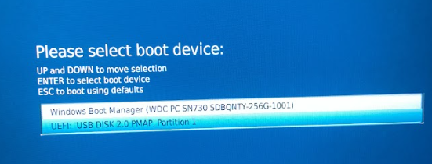

```
Please select boot device:
  UP and DOWN to move selection
  ENTER to select boot device
  ESC to boot using defaults

  Windows Boot Manager (WDC PC SN730 SDBQNTY-256G-1001)
▶ UEFI: USB DISK 3.0 PMAP, Partition 1
```

> `UEFI: USB DISK 3.0 PMAP, Partition 1`을 선택하면 USB로 부팅이 시작된다.

---

### Step 2 — Ubuntu 설치 시작

USB 부팅이 시작되면 Ubuntu 설치 이니셜라이저가 로딩된다.

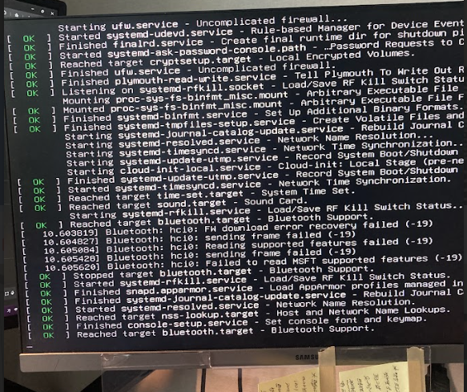

```bash
# 부팅 초기 로그 (요약)
Starting systemd-timesyncd.service - Time & Date Service...
[ OK ] Started systemd-timesyncd.service - Time & Date Service.
Ubuntu 24.04.4 LTS ubuntu-server tty1
connecting...
Waiting for cloud-init... |
```

> **cloud-init이란?**  
> 클라우드·가상화 환경에서 초기 인스턴스 설정(네트워크, 계정, 패키지 등)을 자동화하는 도구.  
> Ubuntu Server는 USB 설치 시에도 cloud-init을 초기화하며 잠깐 대기한다.

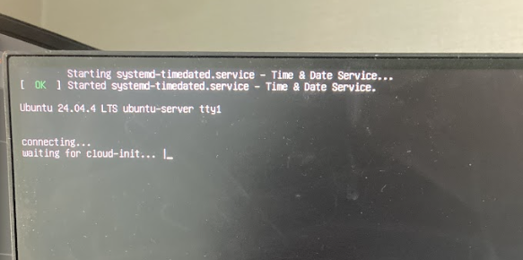

```
Ubuntu 24.04.4 LTS ubuntu-server tty1
connecting...
Waiting for cloud-init... ◐
```

이후 잠시 기다리면 설치 메뉴가 표시된다.

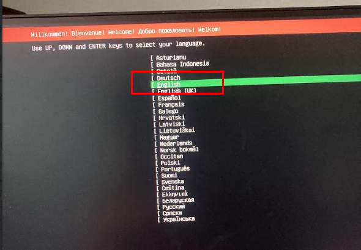

```
▶ Try or Install Ubuntu Server
  Ubuntu Server with the HWE kernel
  Boot from next volume
  Check disc for defects
  ...
```

> **HWE 커널 (Hardware Enablement Kernel)이란?**  
> LTS 기본 커널보다 더 최신 커널을 제공하여 최신 하드웨어 지원을 강화한다.  
> 신형 Wi-Fi 칩셋, GPU 등에 유리하지만 일반 서버 용도라면 기본 "Try or Install Ubuntu Server"로 충분하다.

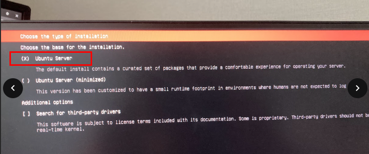

---

### Step 3 — 네트워크 환경 구성 (설치 중)

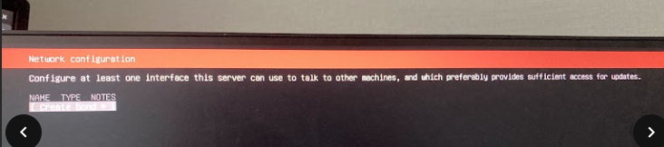

```
Network configuration
Configure at least one interface this server can use to talk to other
machines, and which preferably provides sufficient access for updates.
```

> **이슈 상황**  
> 이상적으로는 이 단계에서 "Connect to wireless network" 옵션이 표시되어  
> Wi-Fi SSID·비밀번호·IP 할당(DHCP) 정보를 입력할 수 있어야 한다.  
> 그러나 Ubuntu Server판은 데스크탑보다 초기 Wi-Fi 드라이버 지원이 적어 인터페이스 자체가 보이지 않을 수 있다.
>
> **처음에 DHCP를 사용하는 이유**  
> 처음엔 공유기가 자동으로 IP를 주게 두는 게 가장 쉽다.  
> 고정 IP 설정은 설치 완료 후에 잡아도 전혀 늦지 않다.
>
> **현실적인 우회책**
> 1. **휴대폰 USB 테더링으로 임시 인터넷 공급** ← 이 방법을 선택
> 2. USB-LAN 어댑터를 임시 사용
> 3. 네트워크 설정을 건너뛰고 설치 후 콘솔에서 직접 설정

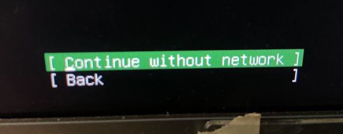

```
[ Continue without network ]
[ Back                     ]
```

우선 네트워크 구성을 생략하고 설치를 계속 진행한다.

---

### Step 4 — Proxy 설정

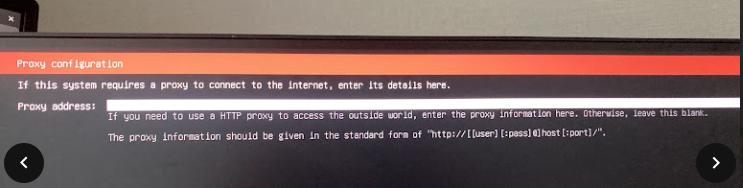

```
Proxy configuration

If this system requires a proxy to connect to the internet, enter its details here.
Proxy address: (비워둠)

If you need to use a HTTP proxy to access the outside world, enter the proxy
information here. Otherwise, leave this blank.
The proxy information should be given in the standard form of
"http://[[user][pass]@]host[:port]/"
```

> **Proxy(프록시)란?**  
> 내 PC와 인터넷 사이에서 중간 대리 역할을 하는 서버.
>
> ```
> [내 서버] ──▶ [Proxy 서버] ──▶ [인터넷 (외부 서버)]
> ```
>
> | Proxy 주요 사용 목적 | 설명 |
> |---------------------|------|
> | 보안 | 외부 인터넷 접근 통제, 특정 사이트 차단 가능 |
> | 트래픽 관리 | 모든 요청을 중앙에서 모니터링·로그 수집 |
> | 캐싱(속도 개선) | 자주 요청되는 데이터를 저장해 다음 요청 시 빠르게 응답 |
> | 폐쇄망(내부망) | 외부 인터넷 직접 접근 불가 환경에서 필수 경로 |
>
> 주로 회사·기관 네트워크에서 사용된다.  
> **개인 홈서버 학습 목적이라면 빈 칸으로 넘어간다.**  
> Proxy 설정이 필요한 경우: 회사 네트워크 내 설치, `apt update`가 막히는 환경.

---

### Step 5 — 디스크 스토리지 파티셔닝

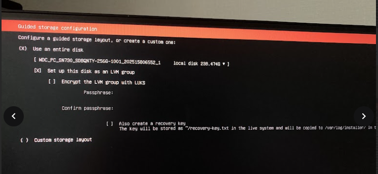

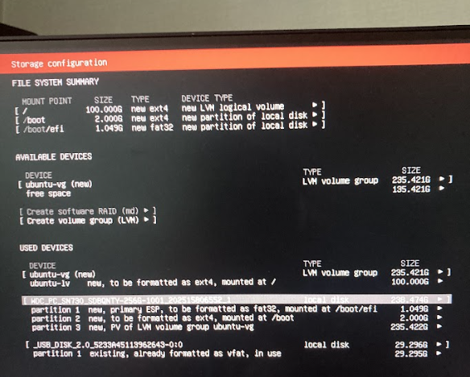

> **처음 홈서버 입문 시에는 "Use entire disk" (전체 디스크 사용) 또는 자동 파티셔닝이 가장 무난하다.**
>
> **자동 파티셔닝 시 기본 구조:**
>
> | 파티션 | 크기 | 용도 |
> |--------|------|------|
> | `/boot/efi` | ~512MB | UEFI 부트 파티션 (부팅에 필요) |
> | `/` (루트) | 나머지 전체 | OS + 앱 + 데이터 |
> | swap | RAM 크기에 따라 자동 | 가상 메모리 (RAM 부족 시 보조) |
>
> **swap이란?**  
> RAM이 부족할 때 디스크 일부를 임시 메모리처럼 사용하는 영역.  
> 속도는 느리지만 메모리 부족으로 프로세스가 강제 종료되는 것을 방지한다.

---

### Step 6 — 사용자 계정 생성

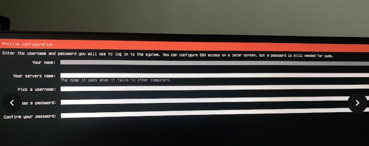

| 항목 | 입력값 | 설명 |
|------|--------|------|
| Your name | bada | 표시 이름 |
| Your server's name (hostname) | `bada-home-server` | 네트워크에서 이 서버를 식별하는 이름 |
| Pick a username | `bada` | SSH 및 로그인 계정명 |
| Password | (설정) | SSH 접속 시 사용 |

> **hostname이란?**  
> 네트워크상에서 이 장치를 식별하는 이름.  
> `ping bada-home-server`처럼 같은 LAN 내에서 이름으로 접근할 수 있고,  
> 터미널 프롬프트(`bada@bada-home-server:~$`)에도 표시된다.

---

### Step 7 — OpenSSH 설치 설정

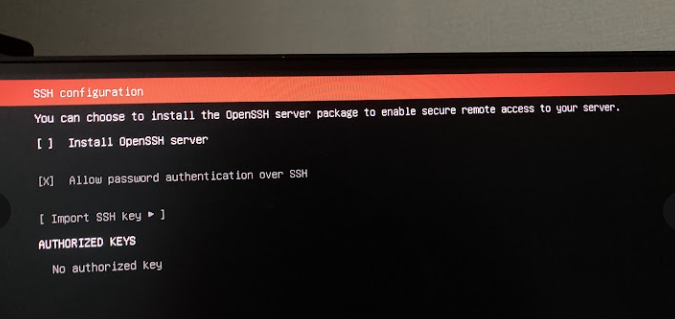

```
SSH configuration

You can choose to install the OpenSSH server package to enable secure
remote access to your server.

[X] Install OpenSSH server

[X] Allow password authentication over SSH

[ Import SSH key ]

AUTHORIZED KEYS
No authorized key
```

> **홈서버라면 OpenSSH는 필수.**  
> 설치 이후부터는 "모니터 없이 노트북에서 SSH로 원격 서버 관리"하는 구조가 훨씬 편하다.
>
> **`Allow password authentication over SSH`를 체크하는 이유**  
> 초기 셋업 단계에서는 비밀번호 인증이 간편하다.  
> 안정화 후에는 SSH 키 인증 방식으로 전환하는 것을 권장한다.
>
> **SSH 키 인증이란?**  
> 비밀번호 대신 공개키/개인키 쌍으로 인증하는 방식.  
> 서버에는 공개키만 등록해두고, 접속 시 개인키로 인증한다. 비밀번호보다 훨씬 안전하다.
>
> ```bash
> # SSH 키 생성 (나중에 할 것, 로컬 PC에서 실행)
> ssh-keygen -t ed25519 -C "내 이메일"
>
> # 생성된 공개키를 서버에 등록
> ssh-copy-id bada@192.168.35.72
>
> # 이후 비밀번호 없이 접속 가능
> ssh bada@192.168.35.72
> ```

---

### Step 8 — 설치 진행 및 완료

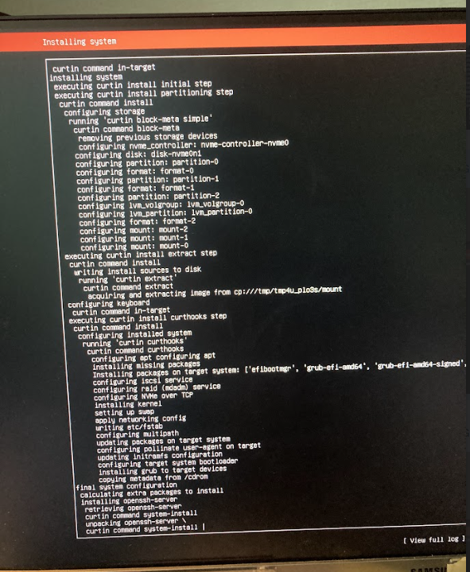

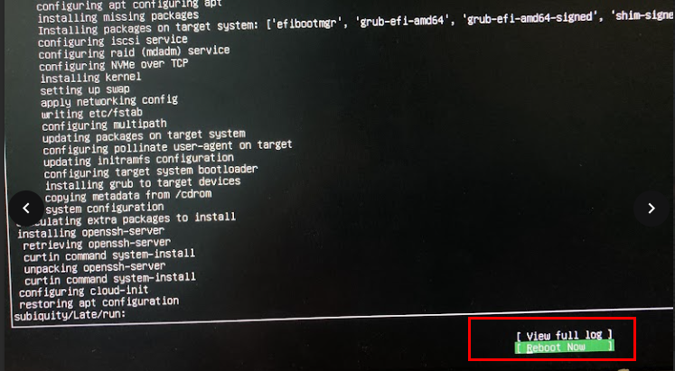

> 설치가 완료되면 **"Reboot Now"** 를 선택한다.  
> **이때 반드시 USB를 먼저 제거한 후 재부팅해야 한다.**  
> USB를 꽂은 채로 재부팅하면 아래 오류가 발생한다:

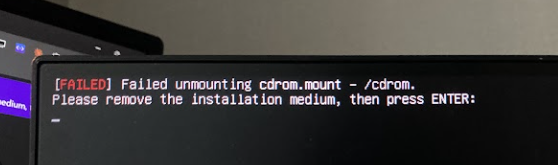

```bash
[FAILED] Failed unmounting cdrom.mount - /cdrom.
Please remove the installation medium, then press ENTER:
```

> 이 화면이 나오면 USB를 뽑고 ENTER를 누르면 된다.  
> 오류처럼 보이지만 정상적인 흐름으로, USB만 제거하면 내부 디스크에서 재부팅된다.

---

### Step 9 — 재부팅 후 부팅 로그

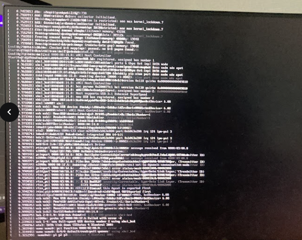

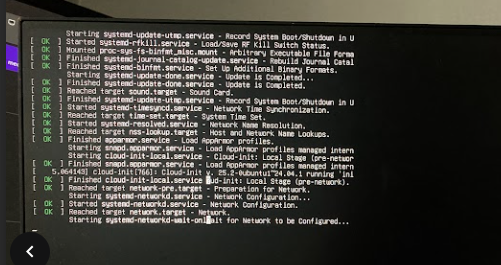

> **systemd 부팅 로그 읽는 법**
>
> | 표시 | 의미 |
> |------|------|
> | `[ OK ]` | 서비스 정상 시작 |
> | `[FAILED]` | 서비스 시작 실패 |
> | `[  **  ]` | 서비스 시작 중 (진행 중) |
>
> 일부 서비스가 `[FAILED]`여도 부팅이 완료되는 경우가 많다.  
> 부팅 완료 후 로그인 프롬프트가 나타나면 성공.

---

### Step 10 — 재부팅 후 로그인

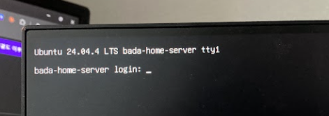

```
Ubuntu 24.04.4 LTS bada-home-server tty1

bada-home-server login: _
```

사용자명 `bada`와 설치 시 설정한 비밀번호를 입력한다.

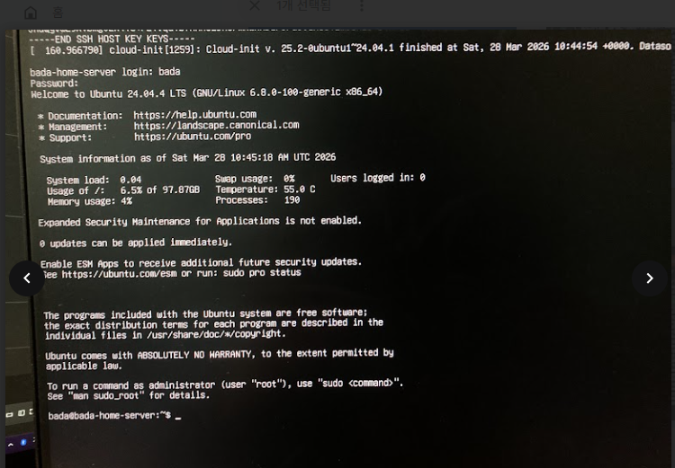

```bash
# 로그인 성공 후 프롬프트
bada@bada-home-server:~$
```

> **프롬프트 구성요소 해석**
>
> | 구성요소 | 의미 |
> |---------|------|
> | `bada` | 현재 로그인한 사용자 |
> | `bada-home-server` | 서버 이름 (hostname) |
> | `~` | 현재 위치 = `/home/bada` (홈 디렉토리) |
> | `$` | 일반 사용자 권한 |
> | `#` | root(관리자) 권한 — `sudo -i`나 `su`로 전환 시 표시 |
>
> **리눅스 디렉토리 구조 (주요 경로 요약)**
>
> | 경로 | 설명 |
> |------|------|
> | `/` | 루트 디렉토리 (최상위) |
> | `/home/bada` | 사용자 홈 디렉토리 (`~`로 축약 표현) |
> | `/etc` | 시스템 설정 파일 모음 |
> | `/var/log` | 시스템 로그 파일 |
> | `/opt` | 서드파티 앱 설치 경로 (관례적) |
> | `/tmp` | 임시 파일 (재부팅 시 삭제) |

---

### Step 11 — 네트워크 환경 확인

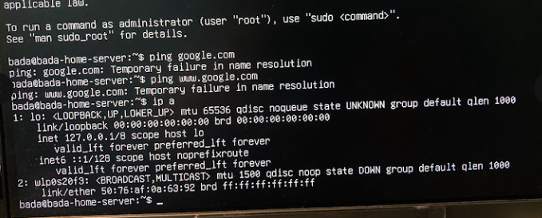

```bash
# 인터넷 연결 확인 — 실패
ping google.com
# ping: google.com: Temporary failure in name resolution

# 네트워크 인터페이스 목록 확인
ip a
# 1: lo: <LOOPBACK,UP,LOWER_UP> ...
#    inet 127.0.0.1/8 scope host lo
# 2: wlp0s20f3: <BROADCAST,MULTICAST> mtu 1500 ...
#    link/ether xx:xx:xx:xx:xx:xx brd ff:ff:ff:ff:ff:ff
#    (inet 없음 → IP 미할당 상태)
```

> - `ping google.com` 실패 → 인터넷 미연결 상태 확인
> - `ip a`로 Wi-Fi 인터페이스(`wlp0s20f3`) 자체는 정상 인식 확인
> - 장치는 인식되었으나 Wi-Fi 설정(SSID, 비밀번호)이 없어 IP 미할당 상태
>
> **`ip a` vs `ifconfig`**  
> `ifconfig`는 구형 명령어로 최신 Ubuntu에는 기본 미설치.  
> `ip a` (`ip addr`의 축약)가 현대적인 대체 명령어이다.
>
> **loopback 인터페이스(`lo`)란?**  
> `127.0.0.1` — 자기 자신을 가리키는 가상 인터페이스.  
> `ping 127.0.0.1`은 네트워크 카드를 거치지 않고 자신에게 루프백한다.

---

### Step 12 — Netplan 설정 파일 작성 (Wi-Fi 연결)

```bash
# netplan 설정 디렉토리 확인
ls /etc/netplan
# 50-cloud-init.yaml  (기본 파일이 존재)

# 새 Wi-Fi 설정 파일 생성 (nano 편집기 사용)
sudo nano /etc/netplan/01-wifi.yaml
```

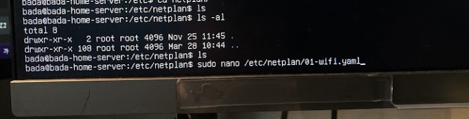

```bash
bada@bada-home-server:/etc/netplan$ ls
-rw-r--r-- 1 root root ... 50-cloud-init.yaml
bada@bada-home-server:/etc/netplan$ sudo nano /etc/netplan/01-wifi.yaml_
```

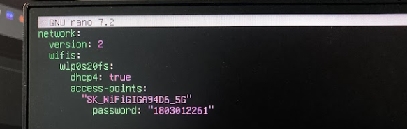

```yaml
# /etc/netplan/01-wifi.yaml
network:
  version: 2
  wifis:
    wlp0s20f3:            # ip a 로 확인한 실제 Wi-Fi 인터페이스명
      dhcp4: true         # 공유기로부터 IP 자동 배정
      access-points:
        "YOUR_WIFI_SSID":       # 실제 Wi-Fi 이름(SSID) 입력
          password: "YOUR_WIFI_PASSWORD"   # 실제 Wi-Fi 비밀번호 입력
```

> **nano 편집기 기본 조작:**
>
> | 단축키 | 동작 |
> |--------|------|
> | `Ctrl + O` | 저장 (Write Out) |
> | `Ctrl + X` | 종료 |
> | `Ctrl + W` | 검색 |
> | `Ctrl + K` | 줄 잘라내기 |
> | `Ctrl + U` | 붙여넣기 |
>
> **YAML 작성 시 주의사항:**
> - 들여쓰기는 반드시 **스페이스**로 (탭 사용 시 오류 발생)
> - 인터페이스명은 `ip a`로 확인한 값을 정확히 입력
> - SSID와 비밀번호는 따옴표로 감싸는 것을 권장 (특수문자 포함 시 필수)

---

#### Netplan apply — 권한 오류 및 해결

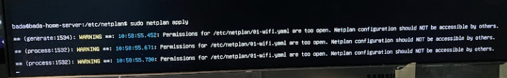

```bash
$ sudo netplan apply
# WARNING: /etc/netplan/01-wifi.yaml has too open permissions
# Permissions for /etc/netplan/01-wifi.yaml are too open.
# Netplan configuration should NOT be accessible by others.
# ...
```

> **리눅스 파일 권한 보안 규칙**에 의한 정상적인 오류.  
> Netplan 설정 파일에는 Wi-Fi 비밀번호가 평문으로 포함되어 있으므로  
> **소유자만 읽기/쓰기**할 수 있도록 제한해야 한다.

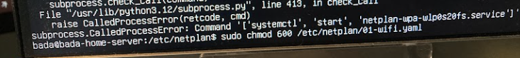

```bash
# 파일 권한을 소유자 읽기/쓰기 전용으로 변경
sudo chmod 600 /etc/netplan/01-wifi.yaml

# 네트워크 설정 적용
sudo netplan apply

# 적용 결과 확인
ip a
```

> **chmod 숫자 권한 읽는 법 (8진수)**
>
> | 숫자 | 권한 | 의미 |
> |------|------|------|
> | 4 | r | 읽기 (read) |
> | 2 | w | 쓰기 (write) |
> | 1 | x | 실행 (execute) |
> | 6 = 4+2 | rw | 읽기 + 쓰기 |
> | 7 = 4+2+1 | rwx | 읽기 + 쓰기 + 실행 |
>
> `chmod 600` → 소유자: `rw-` (6), 그룹: `---` (0), 기타: `---` (0)
>
> **자주 쓰는 chmod 값:**
>
> | chmod | 대상 | 이유 |
> |-------|------|------|
> | `600` | 개인 설정 파일, SSH 키 | 소유자만 읽기/쓰기 |
> | `644` | 일반 파일 | 소유자 읽기/쓰기, 나머지 읽기만 |
> | `755` | 실행 파일, 디렉토리 | 소유자 모두, 나머지 읽기/실행 |
> | `700` | 개인 디렉토리 | 소유자만 접근 |

---

### Step 13 — Wi-Fi 연결 실패 → USB 테더링으로 우회

Netplan 설정 apply 후에도 Wi-Fi 인터넷 연결이 정상적이지 않음.  
펌웨어(firmware) 문제 등이 원인으로 진단됨.  
→ **임시 해결책: 휴대폰 USB 테더링으로 인터넷 연결**

> **USB 테더링이란?**  
> 스마트폰을 "유선 인터넷 공유기"처럼 사용하는 방법.  
> 휴대폰과 미니PC를 USB 케이블로 연결하면, 폰이 "유선 LAN 카드"처럼 동작한다.
>
> **연결 방법:**
>
> | OS | 방법 |
> |----|------|
> | 안드로이드 | `설정 → 개인용 핫스팟 → USB 테더링 ON` |
> | iOS | `설정 → 개인 핫스팟 → 다른 사람의 연결 허용 ON` + USB 연결 후 "이 컴퓨터를 신뢰" 선택 |
>
> **USB 테더링의 동작 원리**  
> 스마트폰이 RNDIS(Windows) 또는 CDC-ECM(Linux) 프로토콜로 USB를 통해 가상 이더넷 어댑터를 제공한다.  
> Linux는 이를 자동 인식하여 `enx...` 형태의 이더넷 인터페이스로 등록한다.

---

### Step 14 — USB 테더링 인터페이스 확인 및 활성화

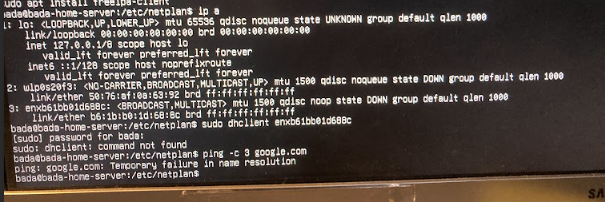

```bash
ip a
# ...
# enxb61bb01d688c: <BROADCAST,MULTICAST> mtu 1500 qdisc noop state DOWN
#   link/ether b6:1b:b0:1d:68:8c brd ff:ff:ff:ff:ff:ff
```

> `enxb61bb01d688c` 인터페이스 확인. **`state DOWN`** → 물리적으로 연결됐지만 아직 비활성화 상태.
>
> **Linux 네트워크 인터페이스 이름 규칙 (predictable network interface names)**
>
> | 접두사 | 의미 |
> |--------|------|
> | `en` | Ethernet |
> | `wl` | Wireless LAN |
> | `lo` | Loopback |
> | `enx` + MAC | USB 기반 이더넷 (MAC 주소 기반 이름) |
> | `enp0s3` | PCI 버스 위치 기반 이름 (p0=버스0, s3=슬롯3) |
> | `wlp0s20f3` | PCI Wi-Fi 인터페이스 |
>
> 이 규칙 덕분에 드라이버 로딩 순서에 관계없이 인터페이스 이름이 일관되게 유지된다.

---

인터페이스를 직접 활성화:

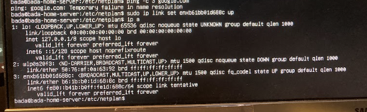

```bash
# USB 테더링 인터페이스를 UP 상태로 전환
sudo ip link set enxb61bb01d688c up
```

---

### Step 15 — Netplan에 USB 테더링 인터페이스 추가 후 apply

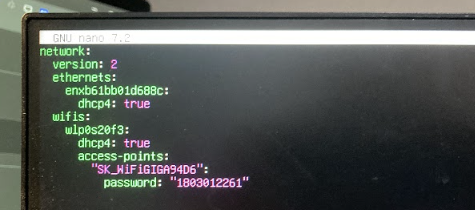

```yaml
# /etc/netplan/01-wifi.yaml (수정 후)
network:
  version: 2
  ethernets:
    enxb61bb01d688c:    # USB 테더링 인터페이스 (ip a로 확인한 이름)
      dhcp4: true       # 스마트폰 핫스팟에서 IP 자동 배정
  wifis:
    wlp0s20f3:
      dhcp4: true
      access-points:
        "YOUR_WIFI_SSID":
          password: "YOUR_WIFI_PASSWORD"
```

> USB 테더링 인터페이스는 이더넷(`ethernets` 섹션)으로 취급된다.  
> DHCP로 설정하면 스마트폰 핫스팟이 `172.20.10.x` 대역의 IP를 자동으로 배정한다.

---

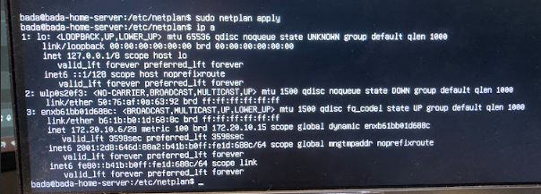

```bash
sudo netplan apply

ip a
# enxb61bb01d688c: <BROADCAST,MULTICAST,UP,LOWER_UP> mtu 1500 ...
#   inet 172.20.10.6/28 brd 172.20.10.15 scope global dynamic enxb61bb01d688c
```

> `inet 172.20.10.6` IP 주소 할당 확인 → USB 테더링을 통한 인터넷 연결 성공.

---

### Step 16 — Wi-Fi 인터페이스까지 모두 연결 확인

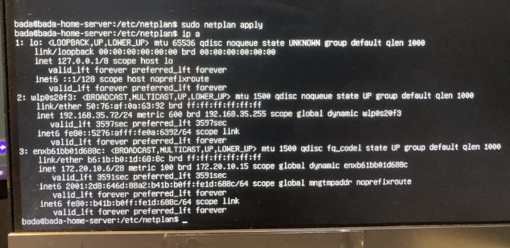

```bash
ip a
# enxb61bb01d688c: inet 172.20.10.6/28   ← USB 테더링 (스마트폰 핫스팟 대역)
# wlp0s20f3:       inet 192.168.35.72/24 ← Wi-Fi (집 공유기 대역)
```

> 두 인터페이스 모두 IP 할당 확인.
>
> | 인터페이스 | IP | 경로 |
> |-----------|-----|------|
> | `enxb61bb01d688c` | `172.20.10.6` | 스마트폰 USB 테더링 (임시) |
> | `wlp0s20f3` | `192.168.35.72` | 집 공유기 Wi-Fi (목표) |
>
> Wi-Fi(`192.168.35.72`)로 인터넷이 되는 것을 확인했으므로,  
> USB 테더링은 이후 제거해도 무방하다.

---

### Step 17 — 공유기 DHCP 예약 (고정 IP 설정)

현재 SSH 접속은 가능하지만, DHCP 방식이기 때문에 서버를 재부팅하면 다른 IP가 배정될 수 있다.  
IP가 바뀌면 SSH 접속 주소도 바뀌어 불편하다.  
→ **공유기에서 MAC 주소 기반으로 항상 같은 IP를 배정하도록 DHCP 예약 설정.**

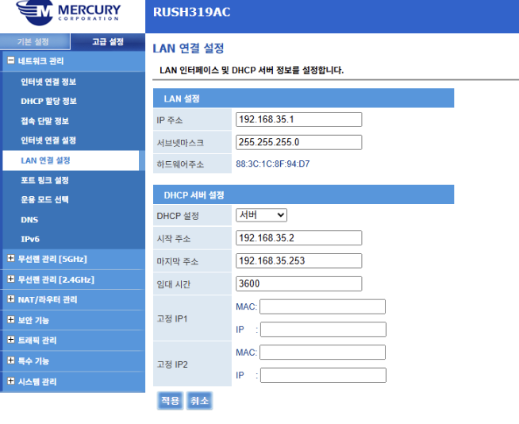

```
Mercury RUSH319AC — LAN 연결 설정

LAN 설정
  IP 주소:    192.168.35.1
  서브넷마스크: 255.255.255.0

DHCP 서버 설정
  DHCP 설정:  서버
  시작 주소:  192.168.35.2
  최대 주소:  192.168.35.253
  임대 시간:  3600 (초)

  고정 IP1: [Wi-Fi MAC 주소] → IP: 192.168.35.72
  고정 IP2: (비워둠)
```

> **DHCP 예약 설정 절차:**
>
> ```bash
> # 1. 홈서버에서 Wi-Fi 인터페이스 MAC 주소 확인
> ip a
> # wlp0s20f3: ... link/ether aa:bb:cc:dd:ee:ff  ← 이 값이 MAC 주소
> ```
>
> 1. 공유기 관리 페이지 접속 (`192.168.35.1` 또는 `192.168.0.1`)
> 2. admin 계정 로그인 (비밀번호 분실 시 공유기 초기화 후 재설정)
> 3. DHCP 예약 항목에 **Wi-Fi MAC 주소 + IP `192.168.35.72`** 입력
> 4. 설정 저장 후 미니PC에서 재부팅 실행
>    ```bash
>    sudo reboot
>    ```
> 5. 재부팅 후 IP 고정 여부 확인
>    ```bash
>    ip a
>    # wlp0s20f3: inet 192.168.35.72/24  ← 동일 IP 유지 확인
>    ```
> 6. 데스크탑에서 SSH 접속 확인
>    ```bash
>    ssh bada@192.168.35.72
>    ```
>
> **DHCP 예약 원리:**
>
> | 방식 | 동작 |
> |------|------|
> | 일반 DHCP | 임대 시간 만료 후 다른 IP 배정 가능 |
> | DHCP 예약 | 해당 MAC 주소에 항상 동일 IP 배정 (재부팅 후에도 유지) |
>
> **DHCP 예약은 다른 기기에 영향 없음** — 특정 MAC 주소에만 적용되는 1:1 규칙이다.

---

> **데스크탑에서 SSH 접속이 가능한 이유**  
> 같은 공유기(LAN)에 연결된 기기끼리는 사설 IP로 직접 통신 가능하기 때문.
>
> ```bash
> # 같은 공유기에 연결된 데스크탑 / 노트북에서
> ssh bada@192.168.35.72
> ```
>
> **집 밖(외부)에서 접속하려면?**  
> 공유기 포트포워딩 설정 필요: `외부IP:22 → 192.168.35.72:22`  
> 공인 IP가 유동적이면 DDNS(Dynamic DNS) 서비스를 연동하면 도메인으로 항상 접근 가능.

---

## 다음 단계 로드맵

> 현재 완료 상태: **Ubuntu Server 설치 + SSH 활성화 + 공유기 고정 IP 설정**

| 단계 | 내용 | 상태 |
|------|------|------|
| 1단계 | Ubuntu Server 설치 + SSH + 고정 IP | ✅ 완료 |
| 2단계 | Docker + Docker Compose 설치 | 🔲 예정 |
| 3단계 | 프로젝트별 Dockerfile + docker-compose.yml 작성 | 🔲 예정 |
| 4단계 | GitHub Actions Self-hosted Runner 설치 | 🔲 예정 |
| 5단계 | deploy-dev.yml → 홈서버 Runner 대상으로 수정 | 🔲 예정 |
| 6단계 | `/opt/cali/application-dev.properties` 서버 설정 | 🔲 예정 |
| 7단계 | 공유기 포트 포워딩 설정 (8050 등) | 🔲 예정 |
| 8단계 | push → 자동 배포 테스트 | 🔲 예정 |

---

### 2단계 예고 — Docker 설치

```bash
# Docker 공식 설치 스크립트 (가장 간편)
curl -fsSL https://get.docker.com | sh

# 현재 사용자를 docker 그룹에 추가 (sudo 없이 docker 명령 실행 가능)
sudo usermod -aG docker $USER

# 변경 사항 적용 (재로그인 또는 아래 명령)
newgrp docker

# Docker 설치 확인
docker --version

# Docker Compose v2 플러그인 설치
sudo apt install docker-compose-plugin

# 확인
docker compose version
```

> **`docker compose` vs `docker-compose`**  
> 예전에는 `docker-compose`(별도 실행 파일, Python 기반)를 사용했지만,  
> Docker v2부터는 `docker compose`(Go 기반 플러그인)로 통합되었다.  
> 최신 환경에서는 **`docker compose`(공백)** 형식을 사용하는 것이 표준.

---

### 3단계 예고 — 프로젝트별 컨테이너 구조

```
# 포트 분리 전략
┌─────────────────┬─────────────┬─────────────────────────┐
│    프로젝트     │ 호스트 포트 │      컨테이너 포트      │
├─────────────────┼─────────────┼─────────────────────────┤
│ CALI (교정관리) │    8050     │          8050           │
├─────────────────┼─────────────┼─────────────────────────┤
│ Dashboard       │    8060     │          8060           │
├─────────────────┼─────────────┼─────────────────────────┤
│ MySQL           │    3306     │   3306 (외부 비노출 권장)│
└─────────────────┴─────────────┴─────────────────────────┘
```

```
# CALI 프로젝트 예시 구조
cali/
├── Dockerfile           # JAR 빌드 + 실행 이미지
├── docker-compose.yml   # app + MySQL 서비스 정의
└── ...
```

---

### 4단계 예고 — GitHub Actions 배포 연동 전략

```yaml
# 브랜치 기반 배포 분기 (개념)
# develop push  →  홈서버(개발) 자동 배포
# main push     →  NCP(운영) 자동 배포
```

**옵션 A: Self-hosted Runner (권장)**
- 미니PC에 GitHub Actions Runner 설치
- Runner가 GitHub을 폴링 → 공유기에 포트 오픈 불필요
- 보안적으로 가장 깔끔한 구조

**옵션 B: SSH 직접 접근**
- 공유기에서 SSH 포트(22) 포워딩 → 외부 IP로 접근
- GitHub Secrets에 SSH 키 등록 필요
- 포트 오픈에 따른 보안 관리 책임 발생

---

*다음 문서: [홈서버 Docker + CI/CD 배포 구축 실습기](홈서버_Docker_CICD_배포_구축_실습기.md)*
